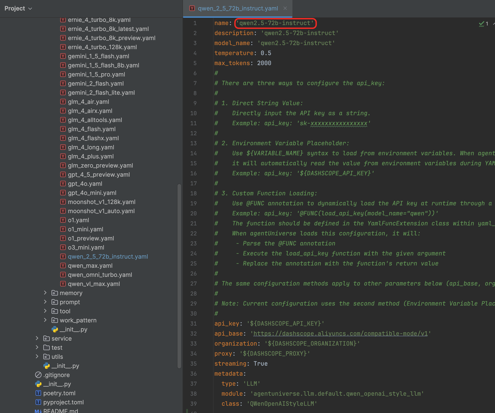

# Quick Start
By this document, you will learn how to quickly run your first example.

## 1.Preparation Work
Before running the example case, ensure that you have installed the necessary runtime environment and completed the project setup.

### 1.1 Preparation of the environment
agentUniverse supports three operating system platforms: `macos`, `linux`, and `windows`. The configuration details for each platform may vary slightly. We won't go into detail here, but you can check the documentation for the necessary steps to ensure all requirements are met, and search for corresponding software configuration tutorials based on your specific platform.

#### 1.1.1 Preparing Python environment
Using **Python 3.10** version

Tips: If you have other Python version environments installed on your computer, it is strongly recommended that you use environment management tools like conda to isolate different multiple Python environments.

#### 1.1.2 Development Tool Preparation
agentUniverse is designed for standard containerized delivery and includes standard images. You can run and modify the source code via shell during the development phase, but this method is not very efficient.

Although this section is not mandatory, we strongly recommend that you install a Python-oriented IDE tool. For an optimal Python development experience, we recommend using PyCharm, followed by VSCode (although configuring VSCode for Python development can be more cumbersome, so it is not advisable for beginners in Python development).

Don't forget to configure the Python interpreter in your chosen IDE tool.

### 1.2 Project Setup
#### 1.2.1 Sample Project Setup
You can download the agentUniverse source code from the project portal webpage or by using `git clone`. 

After completing this section, you will obtain the following project structure, where the `examples/sample_standard_app` folder contains the sample project code.

#### 1.2.2 Install the corresponding framework package
```shell
# framework package
pip install agentUniverse

# Visualization Interface Package
pip install magent-ui ruamel.yaml
```

#### 1.2.3 AK Configuration
This framework supports key injection through environment variables, file configuration, and other methods. We will explain the complete usage in a separate chapter on key settings. Here, we will demonstrate the steps for configuring keys through a file. Please carefully check whether the following steps are followed in order：

##### step1. Confirm that the config file enables automatic reading of the external key file
Locate the main configuration file in the project (path: agentUniverse/examples/sample_standard_app/config/config.toml). Find the SUB_CONFIG_PATH configuration item, and uncomment the custom_key_path configuration item as shown in the picture below:


This step will enable the project to automatically read configuration files and batch load keys. We can see that the custom_key_path configuration option already includes one default path. To simplify the tutorial, we will not modify the path here.

##### step2. Create an external key file based on the template
The external key file template is located at the same level as the config path (specifically at agentUniverse/examples/sample_standard_app/config/custom_key.toml.sample). We will copy custom_key.toml.sample and create a new file, naming it custom_key.toml in accordance with the default configuration of custom_key_path from step 1, as shown in the image below:


Tips: The external key file generally contains all of your access keys (AK), which are very private and need to be strictly protected. This file should never be leaked or managed on code platforms like Git. In actual production projects, we typically separate this file from the project and implement strong system-level permission controls. The steps in the key configuration of this framework are mainly for the sake of production security.

##### step3. In the external key file, configure your commonly used model AK
The key file contains dozens of common model service AK formats. You can fill in your own keys according to your needs. In subsequent tutorials, we will use the Qwen and GPT models as the LLM for the tutorial agent, so here we will configure the corresponding AK for Qwen and GPT as shown in the image below:


## 2. Run the first example
The `sample_standard_app` project already includes a basic agent instance, with its invocation entry point located at: agentUniverse/examples/sample_standard_app/intelligence/test/run_demo_agent.py

In this section, we will run the first example, we use demo_agent (Path: agentUniverse/examples/sample_standard_app/intelligence/test/run_demo_agent.py) to test our first tutorial example.

### 2.1 Determine the agent used behind the example and its configuration
For instance, in the case of demo_agent, we first identify the corresponding agent_name in the script. For the demo, it is demo_agent:


After determining the agent used in the example, we go to the project agent directory (the directory path is: agentUniverse/examples/sample_standard_app/intelligence/agentic/agent/agent_instance) and find the corresponding agent configuration file demo_agent.yaml. Note that the `name` item in the agent yaml configuration is the name of the agent invoked in the test script.


Let's further examine the other configuration details in the demo_agent.yaml file, focusing on the llm_model configuration item. This item specifies the LLM used by the agent. The demo_agent uses the qwen2.5-72b-instruct as the model core. We further refer to the llm directory of the project (directory path: agentUniverse/examples/sample_standard_app/intelligence/agentic/llm) to find the corresponding llm configuration file qwen_2_5_72b_instruct.yaml.



#### switch the llm

If you have configured other series of model types during the key configuration phase, you can find the corresponding llm instances under the `llm` directory. The `sample_standard_app` project has already covered the configuration of commonly used llm instances. For example, you can copy the instance name and replace it under the `llm_model` configuration in `demo_agent.yaml`.

Qwen(qwen-max)
```text
  llm_model:
    name: 'qwen-max'
```

GPT(gpt-4o)
```text
  llm_model:
    name: 'gpt-4o'
```

WenXin(ERNIE-4.0-Turbo-128K)
```text
  llm_model:
    name: 'ERNIE-4.0-Turbo-128K'
```

Kimi(moonshot-v1-128k)
```text
  llm_model:
    name: 'moonshot-v1-128k'
```

Baichuan(Baichuan4-Turbo)
```text
  llm_model:
    name: 'Baichuan4-Turbo'
```

DeepSeek(deepseek-reasoner)
```text
  llm_model:
    name: 'deepseek-reasoner'
```

Tips: To simplify the configuration process, we only list a selection of commonly used llm services here. In addition to model service providers, local deployment models can also be configured. We will not demonstrate this in this chapter, but users with such needs can further refer to the chapters related to LLM configuration.

#### switch the tool
 The demo_agent uses the mock_search_tool by default. The tool has been set up to simulate the search engine results needed for the sample question, "Analyze the reasons behind Buffett's reduction in his stake in BYD." 

You can switch to using the real retrieval tool demo_search_tool in demo_agent.yaml. This tool will provide online retrieval capabilities. To enhance your use case experience, we recommend that you apply for Serper and integrate the API key for the search tool in the key section in advance. Serper has already provided thousands of free retrieval requests for your experience.

You need to apply for a SERPER_API_KEY on the official Serper website and configure it. The official website address： https://serper.dev .

After the application is completed, locate the corresponding key in the `custom_key.toml` mentioned in the key configuration step, as shown below:

```toml
#search.io api
# You could sign up for a free account at https://www.searchapi.io/
# And get the SEARCHAPI_API_KEY api key (100 free queries).
SERPER_API_KEY='xxxxxx'
```

### 2.2 Run the Example
Through the steps above, you have completed all the actions. Run it in your IDE or in the shell.
(Path: agentUniverse/examples/sample_standard_app/intelligence/test/run_demo_agent.py)


When you see the following results, it indicates that the case has run successfully.


## 3. Run the other example
You can now reference and run all other examples.

another examples:
* [react agent use Gemini](https://www.bilibili.com/video/BV1Lbw9e6EsM/?share_source=copy_web&vd_source=6e15707bc107c32d25446b0126ac68da)
